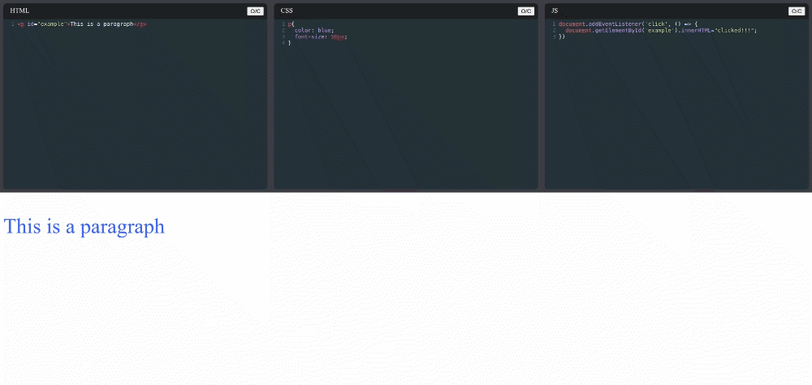

# Create

Create is a Codepen clone. The user can type HTML, CSS and JS code in the respective editors
to see the output in the terminal below.




## To run

```
git clone git@github.com:sayandip18/create.git
cd create
npm install
npm start
```

## Technologies used

* React
* Codemirror

## Features to be added

* Let the user save his work across sessions
